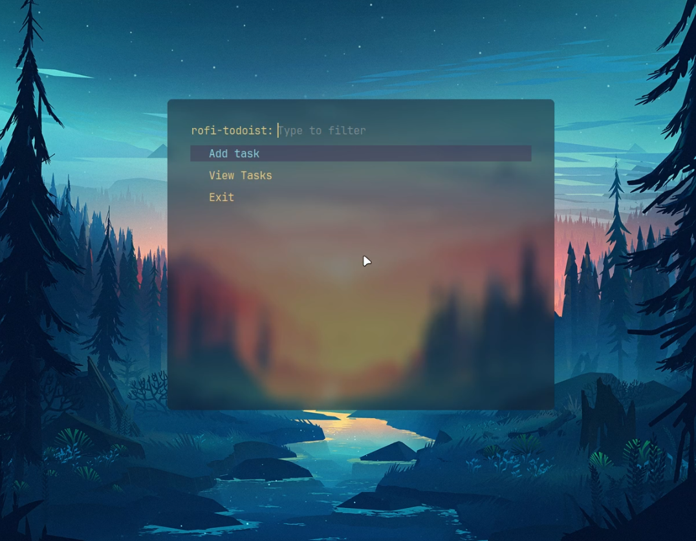

# rofi-todoist

A tool for managing Todoist tasks using Rofi on Linux systems, ideal for productivity enthusiasts and keyboard-centric users.

## Features

### Adding Tasks (Partial support for [QuickAdd](https://todoist.com/es/help/articles/task-quick-add-va4Lhpzz) syntax)

When adding tasks, you can assign properties such as priority or due dates.

- To set a priority, type `p{level}` where `{level}` ranges from 1(normal) to 4(urgent). For example: `p3 Go to market`

- To asign a due date....

### Completing Tasks

Simply select the task you wish you to complete.

### Modifying Tasks

You can update 4 key properties of a task:

- Name
- Description
- Priority
- Due Date

Select the property you want to change and enter a new value.

## Examples


[*my rofi conf*](https://github.com/vcntttt/dotfiles/tree/main/.config/rofi)

## Dependencies

```zsh
sudo pacman -S curl dunst
```

## Environment Variables

To run this project, you will need to add the following environment variables to your .env.sh file

`TODOIST_API_KEY`

`TODOIST_INBOX_ID` or the id of the project you want to work with

## Inspiration

Inspirated in [JustAnotherStrange](https://github.com/JustAnotherStrange/rofi-todoist)

## License

[MIT](https://choosealicense.com/licenses/mit/)
